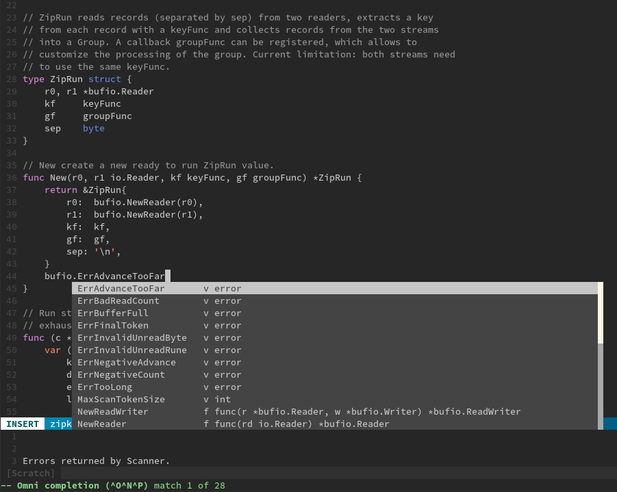
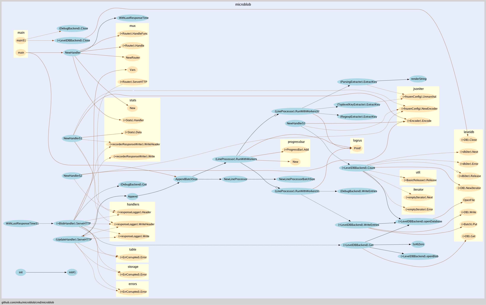

# Editors and Tools

There is an [editor support page](https://golang.org/doc/editors.html), the wiki contains a more comprehensive list:

* [IDEs and Plugins for Go](https://github.com/golang/go/wiki/IDEsAndTextEditorPlugins)

For a good cross-platform experience, the [Visual Studio
Code](https://code.visualstudio.com/) and
[vscode-go](https://github.com/Microsoft/vscode-go) (11,926,535 downloads
currently).

Depending on your setup, I can recommend [vim-go](https://github.com/fatih/vim-go).

A huge project currently in development is
[gopls](https://github.com/golang/tools/blob/master/gopls/README.md), the

> official Go language server developed by the Go team



## goimports

Mostly integrated into editor support: run `go fmt` and sorts out imports.

Install with:

```
$ go install golang.org/x/tools/cmd/goimports@latest
```

Note: Also `go get` works, but `install` is now recommended:
[https://golang.org/ref/mod#go-get](https://golang.org/ref/mod#go-get)

## Quick Help

Run `go doc` to get quick access to documentation.

```
usage: go doc [-u] [-c] [package|[package.]symbol[.methodOrField]]
```

Package docs:

```
$ go doc http
```

Specific symbol:

```
$ go doc http.RoundTripper
```

Current project.

```
$ go doc .
```

You'll need to run this in a directory with Go files, otherwise you might see a:

```
doc: no buildable Go source files in
```

By default, `go doc` will show an overview. To see all documentation for a package:

```
$ go doc -all leveldb # inside a module
$ go doc -all ./skate # outside go mod
```

Or refering to the full package name:

```
$ go doc -all github.com/syndtr/goleveldb/leveldb
```

Show full source:

```
$ go doc -src io.ReadCloser
package io // import "io"

// ReadCloser is the interface that groups the basic Read and Close methods.
type ReadCloser interface {
        Reader
        Closer
}

func NopCloser(r Reader) ReadCloser
```

The `go doc` tool does not come with `...` support.

> The package path must be either a qualified path or a proper suffix of a path.
The go tool's usual package mechanism does not apply: package path elements like
. and ... are not implemented by go doc.


## Navigation

For exploring a larger codebase:

* Jump back and forth to definitions (e.g. `CTRL-g d`, "Go to definition", ...)
* A call graph visualizer


## Call graphs

Install [go-callvis](https://github.com/ofabry/go-callvis), then clone a repo you want to analyze:

```
$ go-callvis -file callgraph -format png -nostd \
    -focus github.com/miku/microblob \
    github.com/miku/microblob/cmd/microblob
```



