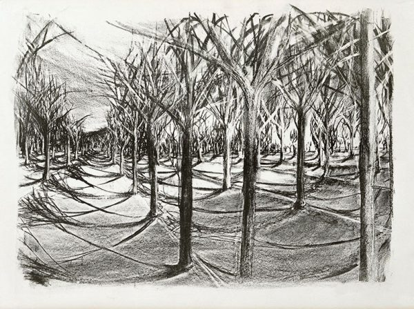
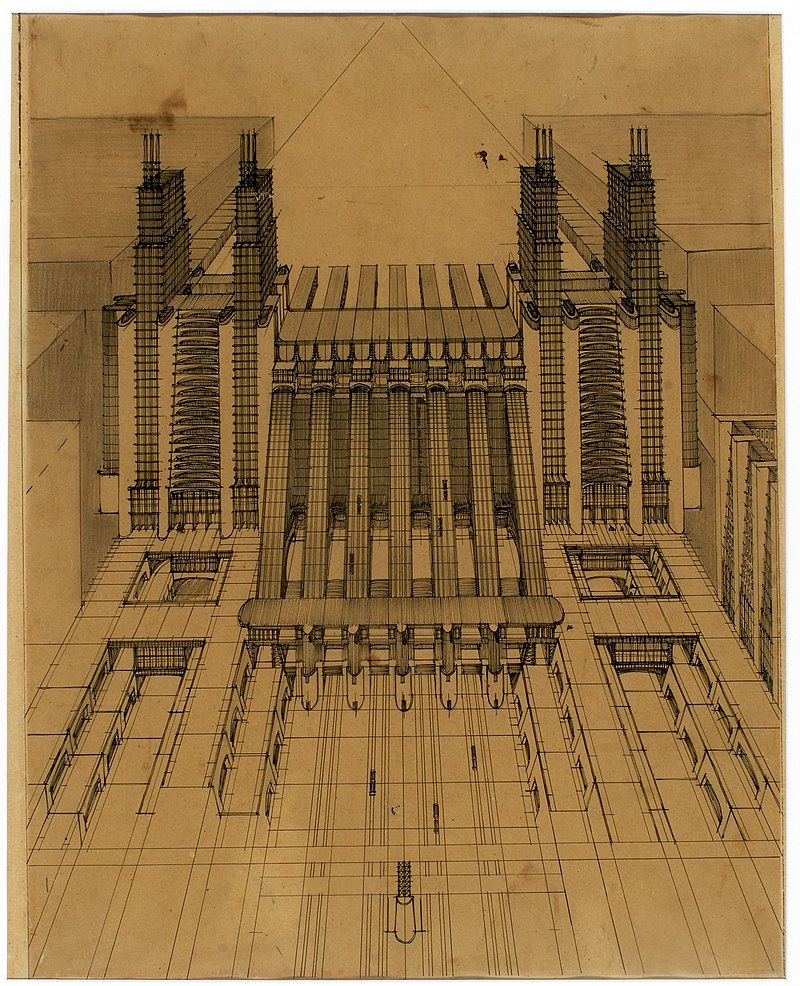
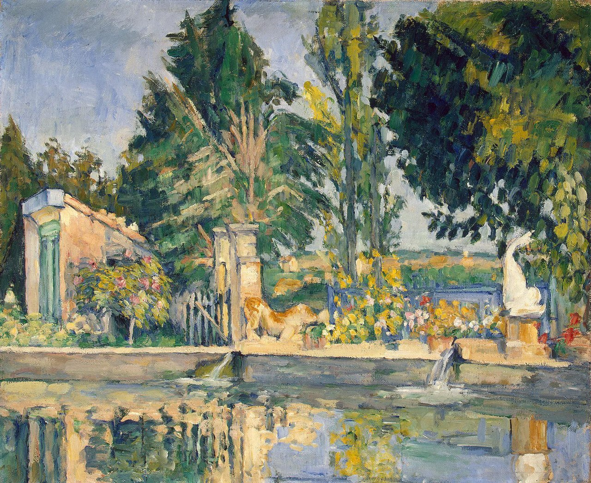

# Go

Welcome to an extended tour through the Go programming language.

## Drawings and Paintings

Go is not as expressive as other languages. We get: only pastel - or only a pencil.

We do not get all the features, we might be used to.

