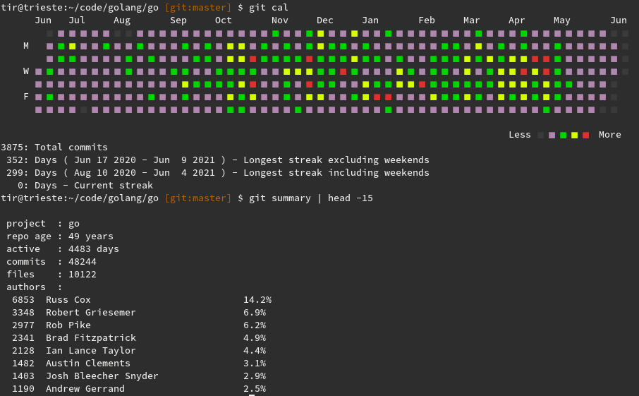

# The Go Ecosystem

* The core language, spec and docs
* The Go development community at [github.com/golang/](github.com/golang/), evolution via [proposals](https://github.com/golang/proposal)



Fun fact: the first commit (7d7c6a97f8) of the Go repo dates 1972-07-18 (a
Tuesday) and contains a file written in
[B](https://en.wikipedia.org/wiki/B_(programming_language)).

```
$ tree
.
└── src
    └── pkg
        └── debug
            └── macho
                └── testdata
                    └── hello.b

5 directories, 1 file

$ cat src/pkg/debug/macho/testdata/hello.b
main( ) {
        extrn a, b, c;
        putchar(a); putchar(b); putchar(c); putchar('!*n');
}
a 'hell';
b 'o, w';
c 'orld';
```

* More and more open source third party libraries, tools and projects: [https://github.com/topics/go](https://github.com/topics/go)
* Strong cloud and microservice story
* More and more documentation and materials


* Migration stories; [patterns](https://apenwarr.ca/log/20190318), [Eigenvectors](https://github.com/golang-leipzig/welcome/blob/master/Slides.md#go)

An online QA community:

* [https://stackoverflow.com/questions/tagged/go](https://stackoverflow.com/questions/tagged/go),
  as of 06/2021: 54,297 questions.

